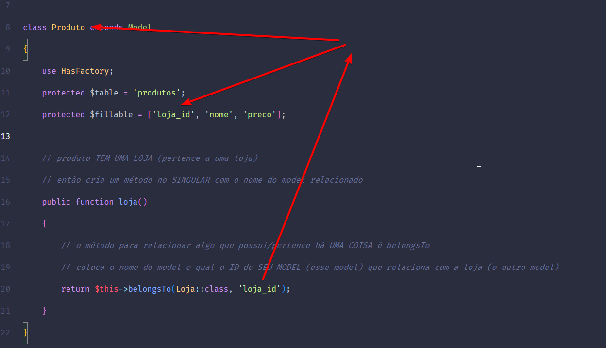
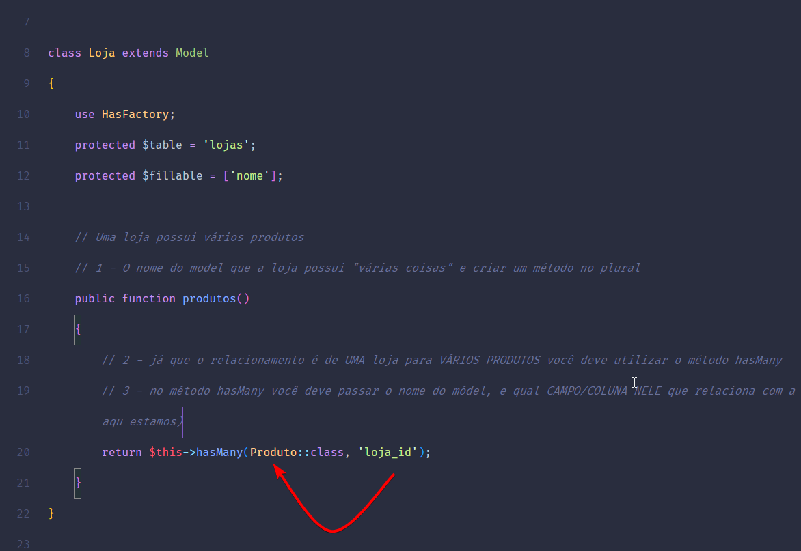
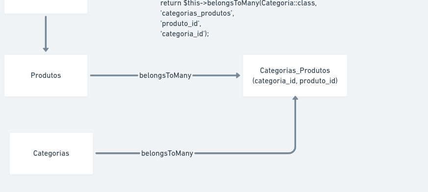
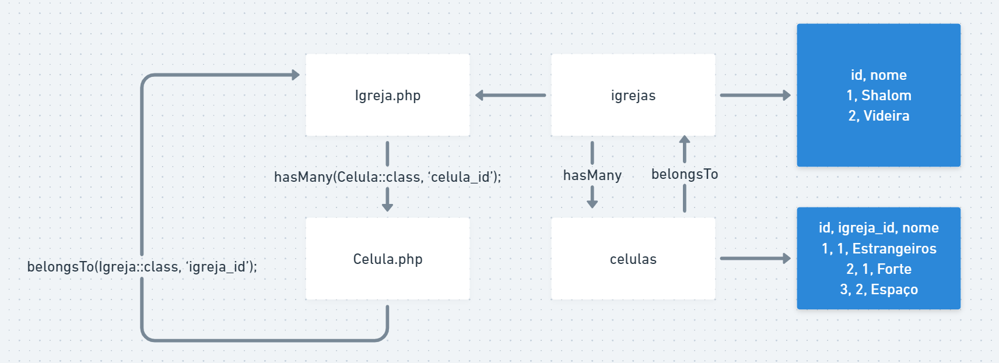
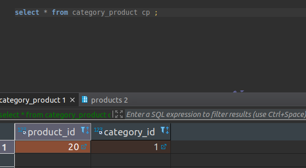

php artisan ui:auth
# Artisan
* Comandos e parametros
    ```sh
    php artisan inspire
    ```

# compact
* Procurar a variavel e cria um array associativo com nome da variavel sendo chave + valor da chave
```php
$teste = null
return view('config.index',  ['teste' => compact('teste')]);

// mesma coisa quew
return view('config.index',  ['teste' => $teste]);

```

# Migrations
* Histórico de execução banco de dados
* Versionar / documentar banco de dados
    * Ex: criar table, add column, etc

* Cria uma table migrations 
    * Registra quais migrações ja foram feitar ou executadas para que não seja executada novamente e não cause conflito

    ```sh
    php artisan migrate:install
    ```
## Comandos gerais
* Criar migração
```sh
php artisan make:migration name_migration
```

* Executar migration
```sh
php artisan migrate
``` 
* Voltar uma migration (último passo)
```sh
php artisan migrate:rollback
```

* Voltar uma migration Escolhendo quantos passos voltar)
```sh
php artisan migrate:rollback --step=quantiadesejada
ex:
php artisan migrate:rollback --step=2
```

* Reexecutar as migrations (antes apaga todas tables)
    * Cuidado caso tiver alguma table sem criada sem migration
    ```sh
    php artisan migrate:fresh
    ```

* Reexecutar sem apagar as tables
    * Da rollback em todas migrations
```sh
php artisan migrate:refresh
```

* Reexecutar sem apagar as tables escolhendo quantos passos vai voltar
    * Da rollback em todas migrations
```sh
php artisan migrate:refresh --step=qtdesejada
ex
php artisan migrate:refresh --step=2
```

* Resetar todas migrations
```sh
php artisan migrate:reset
```

## Criar foreign key
```php
// dentro da migration
$table->unsignedBigInteger('user_id');

// $table->foreign('campo_da_chave')->references('campo_referencia')->on('table_referencia');
$table->foreign('user_id')->references('id')->on('users');

// padrão que usa para criar chave estrangeira
// nomeTable_nomeColuna_foreign 
// stores_user_id_foreign 
```

# Seeds
* dentro de database -> seeders
* Permite criar dados para table pra fazer teste na aplicação
* Alimentar a table com dados
# Criar um seeder
```sh
php artisan make:seeder UsersTableSeeder
```

* Criar básico na mão (dentor de UsersTableSeeder.php em run())

```php
B::table('users')->insert(
    [
        'name' => 'Admin',
        'email' => 'amdin@admin.com',
        'email_verified_at' => now(),
        'password' => '$2y$10$92IXUNpkjO0rOQ5byMi.Ye4oKoEa3Ro9llC/.og/at2.uheWG/igi', // password
        'remember_token' => 'asdfkjakdfjalksjd',
    ]
);
```
* Descomentar a linha dentro do método run() de databaseseeder.php

* Executar
```sh
php artisan db:seed
```

* Fazer refresh e executar seed ao mesmo temop
```sh
php artisan migrate:refresh --seed
```

# Modal factories
* Criar massa de dados fake
```php
\App\Models\User::factory(40)->create();
```

# Models
* Semrpe o nome da table no singular
```sh
php artisan make:model NomeModel
```

# Eloquente 
* ORM
* Traduz base relacionanal para um ponto orientado obj (Model nesse caso)

* Para achar a table Procura o nome do model no plural 
    * Caso for nome diferente usar
    ```php
    
    protected $table = 'name_table';
    ```

## Active Record
* Forma mais básica de criar e editar
* Criar 
```php
    $user = new User();

    $user->name = 'Usuário Teste';
    $user->email = 'email@teste.com';
    $user->password = bcrypt('asdfasdf');
    $user->save();

    return User::all();
```
* Editar
```php
    $user = User::find(1);

    $user->name = 'Usuário Teste de novo';
    $user->save();

    return User::all();

```
## Mass Assignment(atribuição em massa) & Mass Update (atualização em massa)
* Criar fillable no Model
    * Permite quais dados podem serem alterados em massa
```php
protected $fillable = [
    'campo1',
    'campo2',
    'campo3'
];
```
* criação
```php
// passa de uma vez um array com os dados que serão inseridos
// create retorna o proprio criado
$user = User::create([
    'name' => "Nersola silva",
    'email' => "nerdola@gmail.com",
    'password' => bcript('12344817')
])
```

* Atualição
```php
$user = User::find(42);
// update retorna true or false 
// se deu certo ou não
$user->update([
    'name' => 'Atualizando com Mass update';
])
```

## Queries no Eloquent
* Buscar tudo
```php
User::all()
```
* retorna com base no id
```php
User::find(2)
```
* Where
```php
User::where('campo_condicao', 'valor_da_condicao')->get(); 
// Pega primeiro resultado do comando
User::where('campo_condicao', 'valor_da_condicao')->first(); 
```
* Retornar resultado paginado
    * Por pag na web
```php
User::paginate(Quantidade por pag)
ex: 
User::paginate(10)

// ir para prox url
// http://localhost:8000/model?page=2
```

## Casts & Hidden
* Casts
    * Colunas assumem o valor que está no cast
    ex:
    ```php
    protected $casts = [
        'name' => 'boolean'
    ]

    // resultado 
    {
        id: 5,
        name: true,
        email: "chance.koelpin@example.com",
        email_verified_at: "2021-12-07T10:49:24.000000Z",
        created_at: "2021-12-07T10:49:24.000000Z",
        updated_at: "2021-12-07T10:49:24.000000Z"
    },
    ```
    
* Hidden
    * Quando fizer busca na listagem remove a especificada
        * Quando buscar tudo não irá listar o password nem remember_token
    ```php
    protected $hidden = [
        'password',
        'remember_token',
    ];
    ```

# Relacionamentos
* Criar um metodo que ira representar essa ligação
* Um para um
    * Ex: Usuário e loja  - hasOne e belongsTo
        * Um user pode ter uma loja e uma loja pode ter um user
            * hasOne -> usuário tem somente uma loja
            * belongTo -> a loja pertence a  um usuário

    ```php
    // dentro de User
    public function store()
    {
        return $this->hasOne(Store::class, 'user_id');
    }

    //dentro de store (loja)
    public function user()
    {
        return $this->belongsTo(User::class, 'user_id);
    }
    ```

* Um para muitos - hasMay e belongTo
    * Ex: Loja e produtos
        * Uma loja pode ter vários produtos mas um produto pode ter somente uma loja
            * hasMay fica na loja, pq ela é quem tem muitos produtos
            * belongTo fica nos produtos, pq o produto pertence a uma loja 

    ```php
    // em store
    public function products()
    {
        return $this->hasMany(Product::class, 'store_id');
    }

    // em product
    public function store()
    {
        return $this->belongsTo(Store::class, 'store_id');
    }
    ```
    
    

* Muitos para muitos - belongsToMay
    * belongsToMany(
            Model::class,
            'table_que_faz_ligacao', 
            'id_referencia_model_atual_na_table_ligacao', 'id_referencia_model_passado_primeiro_param_na_table_ligacao'
    )

    ```php
    // dentro do model Product
    public function categorias()
    {
        return $this->belongsToMany(Categoria::class, 'categorias_produtos', 'produto_id', 'categoria_id')
    }
    ```

    * Ex: Produtos e categorias
        * Um produto pode ter várias categorias assim como uma categoria pode ter varios produtos
    * OBS: criar uma table que ira relacionar os dois campo ja que é muitos p muitos
        
    ```php
    // em product
    public function categories()
    {
        return $this->belongsToMany(Category::class, 'category_product');
    }

    // em category
    public function products()
    {
        return $this->belongsToMany(Product::class, 'category_product')
    }
    ```
    

* Ex para pensar em relacionamentos


## Model Factories para testes
```sh
php artisan make:factory NomeModelFactory
```

* Criar uma factory e dentro dela passar os campos com funçoes que devera ser preechida
```php
public function definition()
{
    return [
        'name' => $this->faker->name(),
        'description' => $this->faker->sentence(),
        'phone' => $this->faker->phoneNumber(),
        'mobile_phone' => $this->faker->phoneNumber(),
        'slug' => $this->faker->slug(),
    ];
}
```

* Dentro de DatabaseSeeder.php
    * Criando uma loja pra cada usuário
```php
\App\Models\User::factory(40)
    ->create()
    ->each(function($user) { // a cada execução, faz o passado na função recebe o proprio user criado 
        $user->store()
            ->save(\App\Models\Store::factory(\App\Store::class)->make());
});

```

# Queries com Relações
* Um pra um retorna um obj unico
* Muitos p muitos retorna uma collection de dados (objs)

* Quando for hasOne ou belongsTo
    * Retorna o obj em questão
* Quando for hasMany ou belongsToMany
    * Retorna uma coleção dados

```php
// ex de busca
$loja = \App\Models\Store::find(1);
return $loja->products;
```

* Buscar com where em um retorna com coleção
```php
return $loja->products()->where('id', 1)->get();
```
### Fazer count
```php
// quanto retorna somente um obj
dd($user->metodoDentroModel()->count())

// uma coleção de objs
$loja->metodoDentroModel->count();
```

# Inserindo relações
* criar uma loja para um user
```php
// cria uma loja com referencia de id 10
$user = User::find(10);
$store = $user->store()->create([
    'name' => 'Loja teste',
    'description' => 'Loja teste de produtos de informática',
    'phone' => 'XX-XXXX-XXXX',
    'mobile_phone' => 'XX-XXXX-XXXX',
    'slug' => 'loja-teste',
])
```

* Criar um produto para uma loja
```php
$store = Store::find(20);

$product = $store->product()->create([
    'name' => 'Notebook',
    'descriprion' => 'CORE I5 10GB',
    'body' => 'Qualquer coisa..',
    'price' => 2999.90,
    'slug' => 'notebok',
]);

```
* Criar uma categoria
```php

$category = Category::create([
    'name' => 'Games',
    'description' => null,
    'slug' => 'games'
])
```
* Adicionar um produto para uma categoria ou vice-versa
```php
$product = Procuct::find(20);

// adicionar uma categoria de id 1
$category = $product->categories()->attach([1]);
```
    * Resultado


*  remover uma categoria de id 1
```php
// detach - retorna quantidade de itens removidos
$category = $product->categories()->detach([1]);
```

* Adicinar / Remover usando sync
    * Se não tiver add o passado no array
    * Se tiver tiver registrado e não for passado no array, ele remove
```php
$procut->categories()->sync([1, 2]) //adiciona essas duas categorias
$product->categories()->sync([2]) // mantem categoria 2 e remove a categoria 1

```
# Gerar Controller dentro de uma pasta 
```sh
php artisan make:controller Pasta/NomeController
```

# Tipos de rotas disponíveis
* Route::get
    * Mostrar
* Route::post
    * Criar
* Route::put
    * Alterar
* Route::patch
    * Alterar
* Route::delete
    * Apagar
* Route::options
    * Retorna quais cabeçalhos a rota responde

# Usar paginador do laravel
```php
public function index()
{
    $stores = Store::paginate(10);
    return view('admin.stores.index', compact('stores'));
}
```
* Na view
```php
<div class="mt-6">
    {{ $stores->links()}}
</div>
```

## Comando para listar todas as rotas
```sh
php artisan route:list
```

## Formatar número na view
```html
<td>
    {{ number_format($product->price, 2, ',', '.') }}
    // {{ number_format($product->price, número casas decimais, caracter decimal, milhar) }}
</td>
```

## Fazer botão pra deletar
```html
<form action="{{ route('name-route', $id) }}" method="POST">
    @csrf
    @method('DELETE')
    <button type="submit" >Remover</button>
</form>
```
